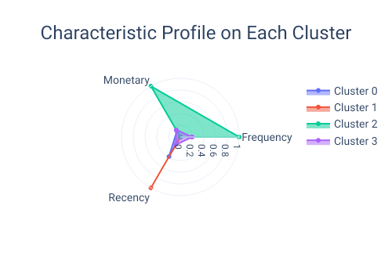
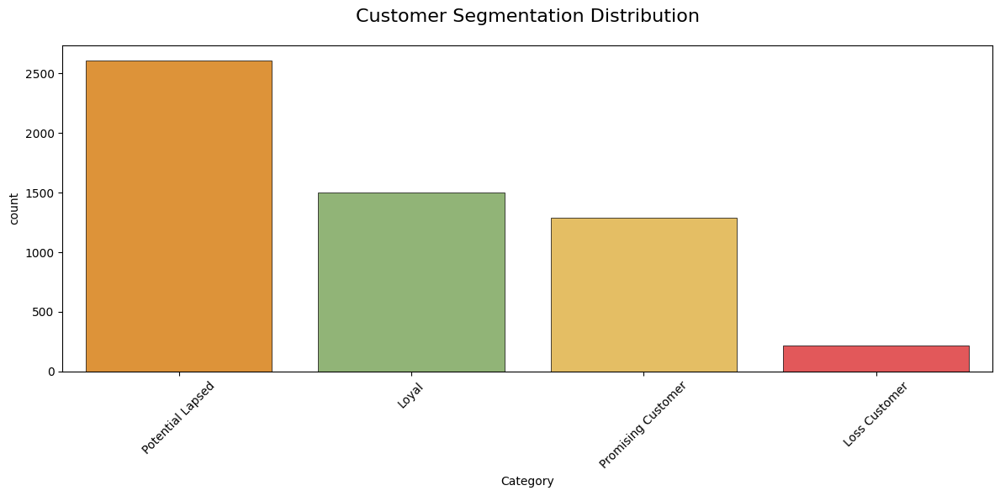

# 🚀 Customer Segmentation RFM Analysis
## 📌 Project Overview
this project try to identify distinct customer segmentetion based on their transactional behavior. By leveraging **RFM (Recency, Frequency, and Monetary)** analysis, this project giving the best strategy for marketing to improve retention dan maximize revenue.

## 🛠️ Tech Stack & Methodology
- **Dataset**: https://archive.ics.uci.edu/dataset/352/online+retail
- **Framework**: RFM (Recency, Frequency, Monetary) Analysis.
- **Clustering Algorithms**: HDBSCAN (Hierarchical Density-Based Spatial Clustering) and GMM (Gaussian Mixture Model).
- **Libraries**: Pandas, NumPy, Scikit-learn, HDBSCAN, Matplotlib, Seaborn.
## ⚙️ Feature Engineering RFM
I implemented a structured process to get Recency, Feature, and Monetary Feature
- **Data Cleaning**: Extracted total purchase values and addressed anomalies in Quantity and UnitPrice.
- **Handling Outlier**: evaluated several techniques, including Quantile, Log, Yeo-Johnson transformation and Box-Cox transformations.
- **Optimal Transformation**: The Yeo-Johnson Transformation was selected as the final method, as it effectively normalized the distribution and minimized the impact of outliers compared to other techniques.
- **RFM Feature Engineering**: Grouped the cleaned data by CustomerID to calculate:
  Recency: Days since the last purchase.
  Frequency: Total number of transactions.
  Monetary: Total spending per customer.
- **Scaling**: Applied feature scaling to the RFM table before feeding it into the HDBSCAN and GMM models.
## 📈 Result & Strategic Insights

### Result
Based on the clustering result, the model successfully identified 4 cluster: **Loyal Customer**, **Promising Customer**, **Potential Lapsed Customer**, and **Loss Customer**.
- **Loyal Customer** with the highest total expenses, the most frequent customer to visit, and have the lowest recency (active recently).
- **Promising Customer** with moderate expenses, frequency, and recency(relatively recent transactions).
- **Potential Lapsed Customer** with moderate to high recency (showing signs of churn), and moderate expenses and low frequent visit.
- **Loss Customer** with the highest recency and the lowest expenses and frequency.
### Strategic Insight
To improve Retention and Revenue, I recommend the following targeted strategies:
- **Potential Lapse Customer**, send personalized discount coupons and marketing brochures to re-ignite their interest and prevent them from moving to a competitor.
- **Loyal Customer**, implementing Up-selling strategies by promoting premium/luxury items. Offer exclusive services or early access to new collections to maintain high satisfaction.
- **Promising Cutomer**, use a personalized recommendation engine to suggest products that align with their previous purchases. The goal is to increase their purchase frequency and move them into the "Loyal" tier.
- **Loss Customer**, attempt a low-cost re-engagement via email. If there is no response, minimize marketing spend on this group. Reallocating the budget from this segment to the Potential Lapsed or Promising clusters will yield a much higher Return on Investment (ROI).

